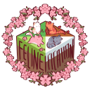

Felineification
---

 
>Felineification! Let your eye boggle and your hearts speed up at this fluffy modpack! Felineification is a vanilla+ modpack aimed at providing the player game-changing features without straying too far from vanilla.

> Thanks to
>* ziwie
>* dero2y

>Modpack contains the following:
>>- Iceberg
>>- Highlighter
>>- Chat Heads
>>- Dark Loading Screen
>>- Resourceful Lib
>>- Searchables
>>- ToolTip Fix
>>- Prism
>>- Forge Config API Port
>>- YUNG's Better Mineshafts
>>- Drip Sounds
>>- Eating Animation
>>- More Chat History
>>- Mouse Tweaks
>>- YUNG's Extras
>>- Handcrafted
>>- Controlling
>>- Tom's Simple Storage Mod
>>- LambDynamicLights
>>- Legendary Tooltips
>>- Panoramica
>>- AppleSkin
>>- Better Advancements
>>- GlitchCore
>>- Midnight Controls
>>- Shulkerbox tooltips
>>- Boat Item View Fabric
>>- CraftPresence
>>- Falling Leaves
>>- Waystones
>>- Sodium
>>- Iris
>>- Ears
>>- Lithium
>>- Fabric API
>>- InvMove
>>- Trinkets
>>- CraterLib
>>- Konkrete
>>- Melody
>>- SereneSeasons
>>- Mod Menu
>>- Better Ping Display
>>- Visuality
>>- Memory Leak Fix
>>- Equipment Compare
>>- LazyDFU
>>- Carry-On
>>- Presence Footsteps
>>- YUNG's API
>>- FancyMenu
>>- Cloth Config v13
>>- AntiGhost
